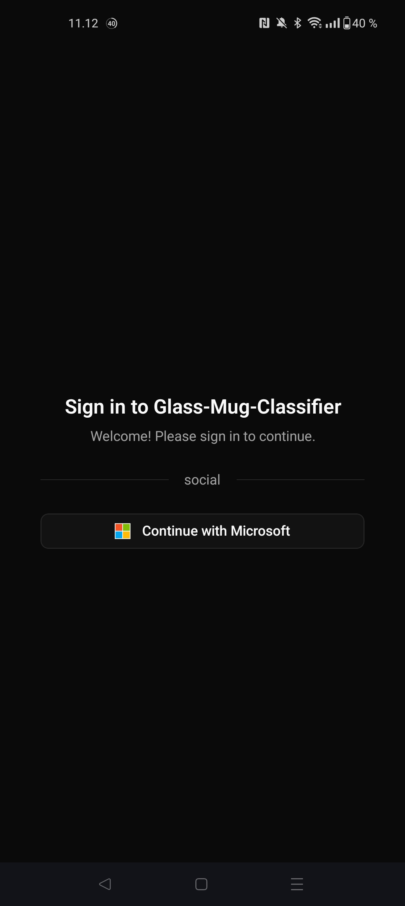
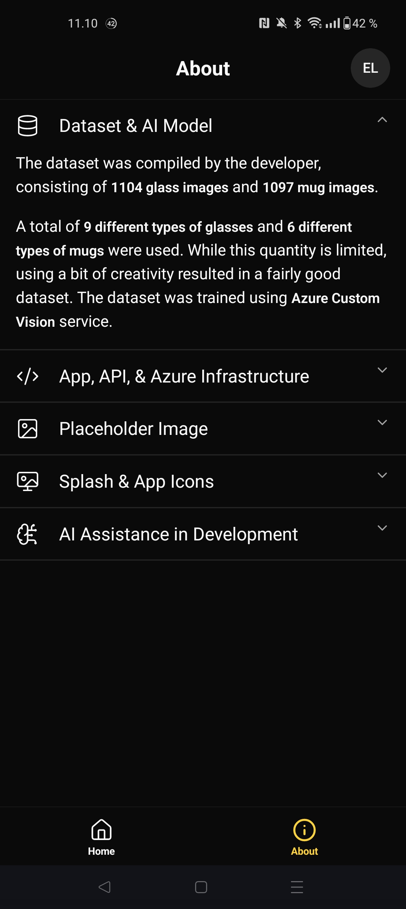
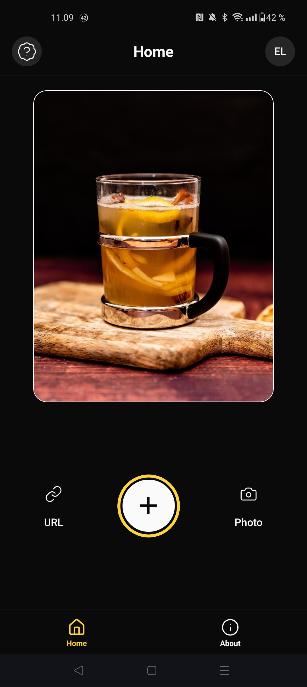
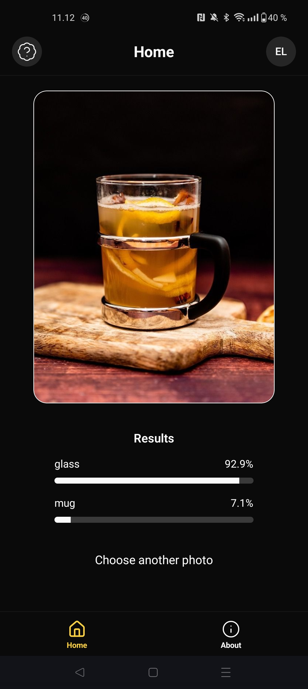
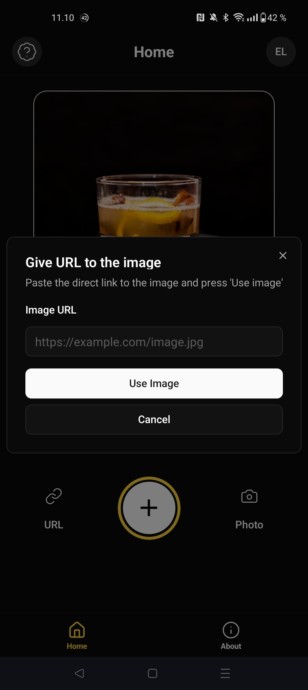
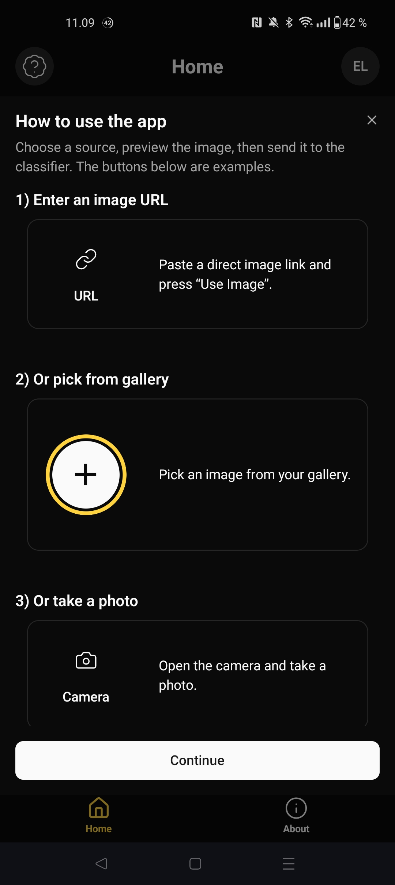
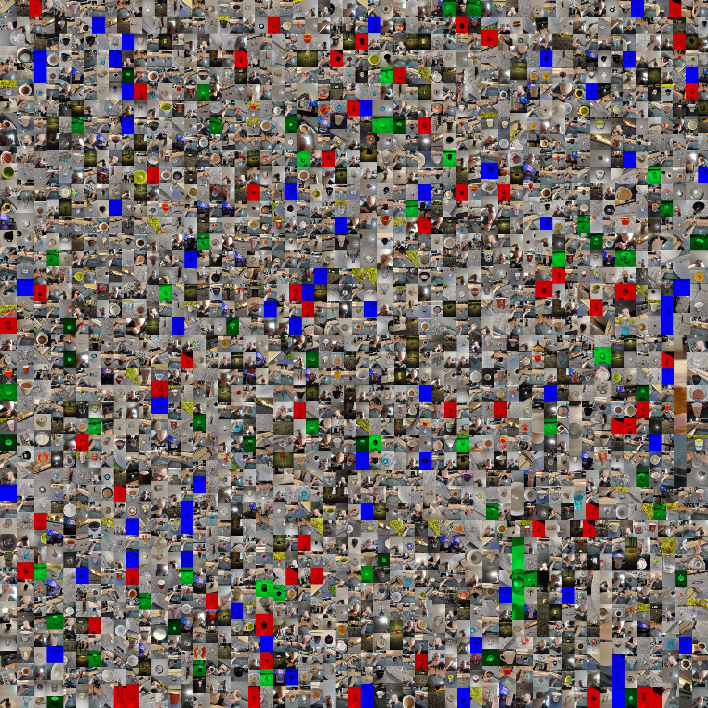
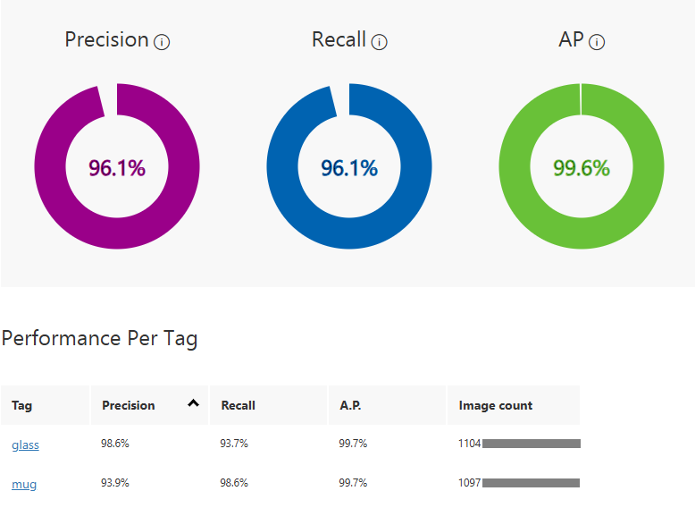

# 🥛 Glass & Mug Classifier

A mobile application built with **React Native** and **Expo** to classify images of glasses and mugs. This app leverages a custom AI model trained with **Azure Custom Vision** and is supported by a secure backend built on **Azure Functions** with **Microsoft Entra ID** for authentication.

<details>
  <summary>Watch demo</summary>
       <br/>
       <div align="center">
              <video src="https://github.com/user-attachments/assets/de6c4db8-0e53-4615-9a1d-45d479a9622a"
                     controls
                     muted
                     playsinline
                     width="360">
              </video>
       </div>
       <br/>
       <p align="center">
         <em>
           Placeholder and demo classification images sourced from Pixabay:<br/>
           <a href="https://pixabay.com/photos/mulled-wine-christmas-drink-6704928/">
             Orange drink – photo by kaheig
           </a><br/>
           <a href="https://pixabay.com/photos/water-glass-liquid-wet-refreshment-3853492/">
             Water in glass – photo by cocoparisienne
           </a><br/>
           <a href="https://pixabay.com/photos/mug-marshmallows-fox-leaves-autumn-8231225/">
             Fox mug with marshmallows – photo by Ylanite
           </a>
         </em>
       </p>
       
</details>

---

## 🔍 Core Features

### 🔐 Secure Authentication
-   **Microsoft Entra ID:** Ensures that the API and user data are protected with secure sign-in.
-   **Persistent Sessions:** Users remain logged in between sessions for a seamless experience.

<br>

<p align="left">
  <table width="100%">
    <tr>
      <th style="text-align:center;" width="50%">Login Screen</th>
      <th style="text-align:center;" width="50%">About Screen</th>
    </tr>
    <tr>
      <td style="text-align:center;">
        <p align="center">
                
        </p>
      </td>
      <td style="text-align:center;">
        <p align="center">
                
        </p>
      </td>
    </tr>
    <tr>
      <th colspan="2" style="text-align:center;">
        <em>Click the image to view it larger</em>
      </th>
    </tr>
  </table>
</p>

---

### 🖼️ Image Classification
-   **Multiple Input Methods:** Users can provide an image by pasting a URL, selecting from the device gallery, or taking a photo with the camera.
-   **AI-Powered Analysis:** The image is sent to the custom-trained Azure Custom Vision model for classification.
-   **Clear Results:** The app displays the classification results with confidence scores for both 'glass' and 'mug'.
-   **In-App Guide:** A help screen provides clear instructions on how to use the application.

<br>

<p align="left">
  <table width="100%">
    <tr>
      <th style="text-align:center;" width="50%">Home & Image Sources</th>
      <th style="text-align:center;" width="50%">Classification Results</th>
    </tr>
    <tr>
      <td style="text-align:center;">
        <p align="center">
          <div>
            
          </div>
        </p>
      </td>
      <td style="text-align:center;">
        <p align="center">
          <div>
            
          </div>
        </p>
      </td>
    </tr>
    <tr>
      <th colspan="2" style="text-align:center;">
        <em>Click the image to view it larger</em>
      </th>
    </tr>
  </table>
</p>

<br>

<p align="left">
  <table width="100%">
    <tr>
      <th style="text-align:center;" width="50%">URL Input</th>
      <th style="text-align:center;" width="50%">Instructions</th>
    </tr>
    <tr>
      <td style="text-align:center;">
        <p align="center">
          <div>
            
          </div>
        </p>
      </td>
      <td style="text-align:center;">
        <p align="center">
          <div>
            
          </div>
        </p>
      </td>
    </tr>
    <tr>
      <th colspan="2" style="text-align:center;">
        <em>Click the image to view it larger</em>
      </th>
    </tr>
  </table>
</p>

---

## 🤖 AI Model & Dataset

The classification model was trained on a custom dataset compiled by the developer.

-   **Dataset Size:** `1104` images of glasses and `1097` images of mugs.
-   **Variety:** The dataset includes **9 different types of glasses** and **6 different types of mugs** to improve model robustness.
-   **Training Platform:** The model was trained and deployed using **Azure Custom Vision**, achieving high precision and recall metrics.

<br>

<p align="center">
  
  <br>
  <em>A collage of the training dataset.</em>
</p>

<p align="center">
  
  <br>
  <em>Custom Vision model results.</em>
</p>

---

## 🛠️ Technologies Used

-   **Frontend:** React Native, Expo, TypeScript, Tailwind CSS
-   **Backend & Cloud:** Azure Functions, Azure Custom Vision, Microsoft Entra ID, Microsoft Graph, Azure Key Vault
-   **UI & Icons:** `React Native Reusables`, `lucide-react-native`

---

## 🚀 Project Setup

You can install the project dependencies and launch the Expo development client by running:

```bash
npm install
npx expo start
```

### ⚠️ Important Note on Functionality

This repository is intended as a portfolio piece and is **not runnable out of the box**.  
The backend is secured with **Microsoft Entra ID** and configured to grant access **only to the developer's account**. This is a deliberate security measure to protect cloud resources and API keys.

Consequently, if you run the application locally, you will be able to see the UI, but any action that requires backend communication (i.e., logging in and submitting a photo for classification) **will result in an authentication failure**.

<details>
  <summary>How to Replicate the Setup</summary>


  ### Steps

  To run this project with full functionality, you would need to create and configure your own backend infrastructure on Microsoft Azure. This would involve the following key steps:

  1.  **Deploy a Custom Vision Model:** Train and publish your own classification model to get a `Prediction-Key` and two endpoint URLs (one for image URLs, one for file uploads).

  2.  **Create an Azure Key Vault:** This service will securely store your secrets. Add the following three secrets to your Key Vault:
      *   `CustomVisionPredictionKey`: The `Prediction-Key` from your model.
      *   `CustomVisionEndpointUrl`: The prediction endpoint for image URLs.
      *   `CustomVisionEndpointFile`: The prediction endpoint for direct image file uploads.

  3.  **Create and Deploy Azure Functions:** The Function App serves as a secure intermediary (proxy) that hides your Custom Vision keys from the client application. The client calls your functions, which then securely call the Custom Vision API using the keys from Key Vault.

      You will need to create two separate **HTTP Trigger** functions within your Function App. The easiest way to do this is using the [Azure Functions extension in Visual Studio Code](https://marketplace.visualstudio.com/items?itemName=ms-azuretools.vscode-azurefunctions).

      #### Function 1: `predictFromUrl`
      This function handles predictions when the user provides an image URL.

      ```javascript
        import { app, HttpRequest, HttpResponseInit} from "@azure/functions";

        app.http("predict-url", {
          methods: ["POST"],
          authLevel: "anonymous",
          route: "predict/url",
          handler: async (request: HttpRequest): Promise<HttpResponseInit> => {
              const body: any = await request.json();
              const imageUrl = body.url;

              if (!imageUrl) {
                    return { status: 400, jsonBody: { error: "URL is missing" } };
              }

              const endpoint = process.env.CUSTOM_VISION_ENDPOINT_URL;
              const predictionKey = process.env.CUSTOM_VISION_PREDICTION_KEY;

              const response = await fetch(endpoint, {
                    method: "POST",
                    headers: {
                      "Prediction-Key": predictionKey,
                      "Content-Type": "application/json"
                    },
                    body: JSON.stringify({ Url: imageUrl })
              });

              const results = await response.json();
              return { jsonBody: results };
          }
        });
      ```

      #### Function 2: `predictFromFile`
      This function handles predictions when the user uploads an image from their gallery or camera. It forwards the raw image data.

      ```javascript
        import { app, HttpRequest, HttpResponseInit} from "@azure/functions";

        app.http("predict-image", {
          methods: ["POST"],
          authLevel: "anonymous",
          route: "predict/image",
          handler: async (request: HttpRequest): Promise<HttpResponseInit> => {
              const imageBuffer = await request.arrayBuffer();

              if (!imageBuffer || imageBuffer.byteLength === 0) {
                    return { status: 400, jsonBody: { error: "Image data is missing" } };
              }

              const endpoint = process.env.CUSTOM_VISION_ENDPOINT_IMAGE;
              const predictionKey = process.env.CUSTOM_VISION_PREDICTION_KEY;

              const response = await fetch(endpoint, {
                    method: "POST",
                    headers: {
                      "Prediction-Key": predictionKey,
                      "Content-Type": "application/octet-stream"
                    },
                    body: imageBuffer
              });

              const results = await response.json();
              return { jsonBody: results };
          }
        });
      ```


  4.  **Configure the Function App and Key Vault Connection:**
      *   In your Function App, enable a **Managed Identity**.
      *   Go to your Key Vault and grant this Managed Identity the "Key Vault Secrets User" role.
      *   In the Function App's configuration, create application settings that reference the Key Vault secrets using the syntax `@Microsoft.KeyVault(SecretUri=...)`.

  5.  **Set up and Configure an App Registration in Microsoft Entra ID:** This registration defines the API you are protecting (your Azure Function) and configures the authentication flow for your client app.

      **a. Expose the API:** This step defines a unique identifier for your API and creates permissions (scopes) that the client can request.
      *   In the App Registration, navigate to the **Expose an API** section.
      *   Set the **Application ID URI**. A common format is `api://<your-client-id>`.
      *   Add a new scope. For example:
          *   **Scope name:** `access_as_user`
          *   **Who can consent?:** Admins and users
          *   **Admin/User consent display name:** Access the Glass-Mug-Classifier API
          *   **Admin/User consent description:** Allows the app to call the API on your behalf.

      **b. Configure Redirect URIs:** This tells Microsoft's authentication service where to send the user back to after a successful login.
      *   Navigate to the **Authentication** section and click "Add a platform".
      *   Select **"Mobile and desktop applications"**.
      *   Add the necessary Redirect URIs. For Expo development, these are critical and must match your environment exactly:
          *   `exp://192.168.1.100:8081` (Example for **Expo Go**; the IP and port will match your local development machine).
          *   `yourscheme://path` (For running **React Native** application).

  6.  **Configure Function App Authentication:** Secure the Function App's HTTP triggers by going to its "Authentication" settings and adding an Identity Provider. Configure it to use the App Registration you just created. This enforces that every API call must have a valid access token.

  7.  **Update the Client Configuration:** Update the environment variables in the React Native application to point to your new Azure Function URLs (for `predictFromUrl` and `predictFromFile`) and your new Entra ID configuration (Client ID, Tenant ID, and the API scope you created).
</details>

---

## 🧠 AI Assistance in Development

AI tools (**ChatGPT** and **Gemini**) were used throughout the project as a complement to official documentation, especially for understanding Azure concepts such as App Registrations, Managed Identities, Key Vault integration, and the Microsoft Graph API.

Due to the steep learning curve of native development, the complexity of secure cloud authentication, and tight deadlines, I relied on AI assistance more heavily than I would in an ideal scenario. While this occasionally shows in the code’s structure and readability, the core architecture and decisions remain my own.

Going forward, my goal is to use AI more as a structured pair-programmer: focusing on improving code quality, maintainability, and testing practices, rather than just unblocking problems under time pressure.

---

## 💡 Personal Experience & Challenges

The biggest challenge was the combination of a tight final schedule and the complexity of a secure cloud backend. Configuring **Microsoft Entra ID** authentication and integrating the **Microsoft Graph API** for user data were the most time-consuming parts.

---

## ⚠️ Known Issues

-   The application currently has some known bugs, primarily related to **ScrollView behavior** in certain contexts.
-   The app may occasionally crash on the first login after installation.
-   The overall UI/UX is functional but still requires further refinement and polishing to improve the user experience.

---

## 📋 To-Do List

-   [x] Add video demonstration
-   [x] Finalize README.md
-   [ ] Fix known ScrollView issues
-   [ ] Investigate and fix occasional first-login crash
-   [ ] Conduct a thorough UI/UX audit and implement improvements
-   [ ] Refactor components for better reusability and maintainability
-   [ ] Optimize API call performance and error handling